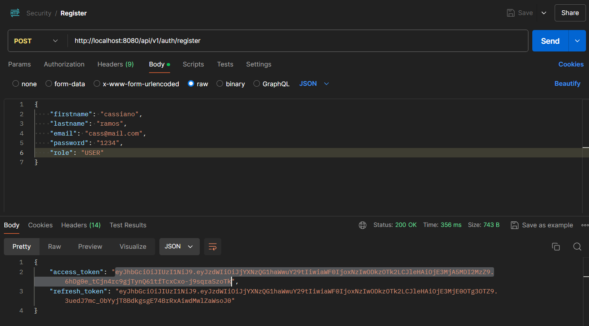
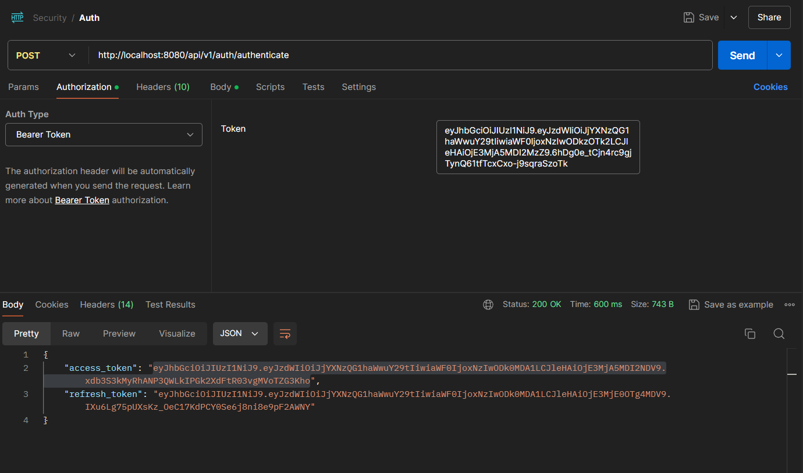
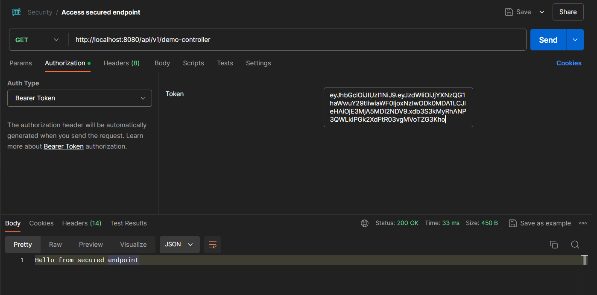
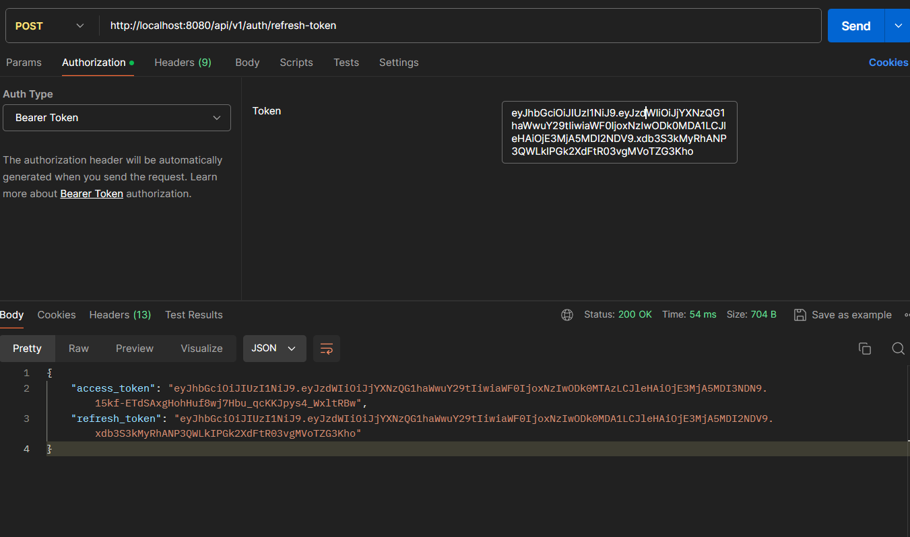
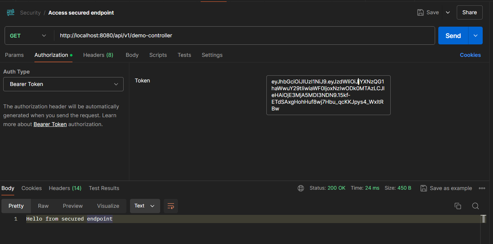
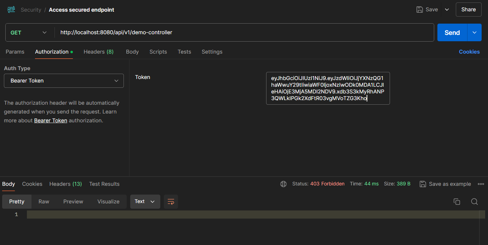
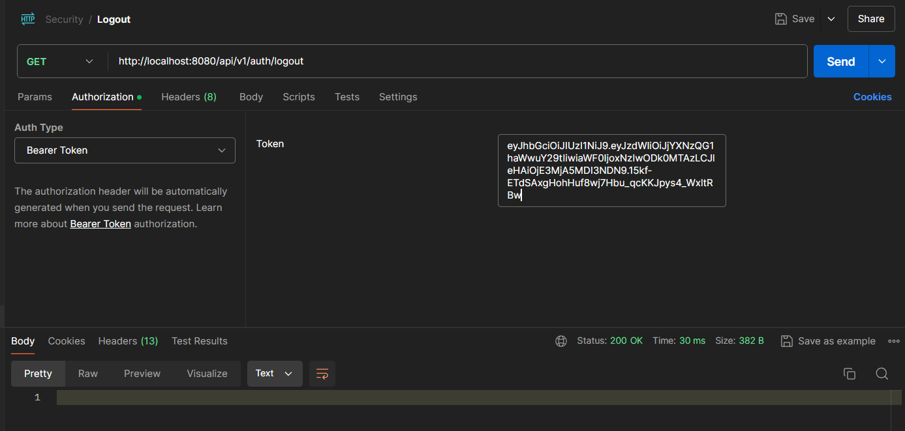
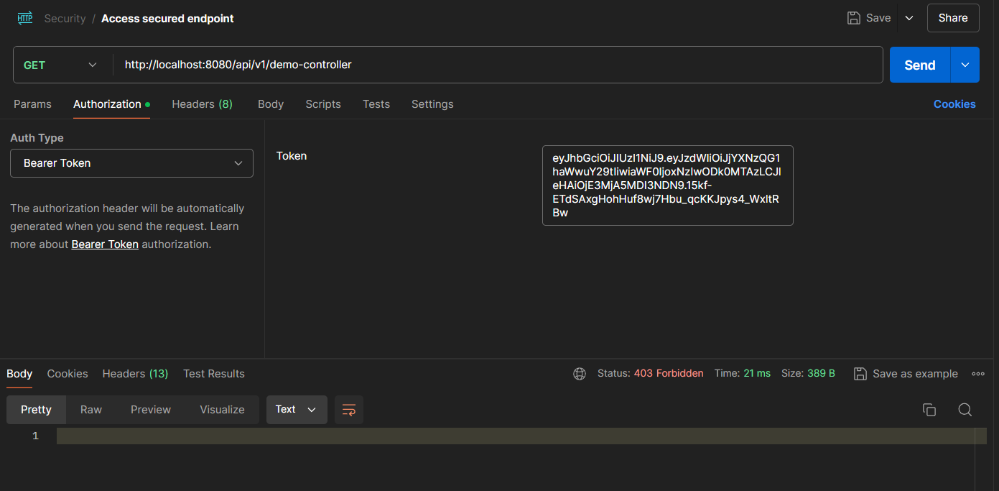

<h1 align="center"> Spring Security </h1>

  <a href="#-tecnologies">Tecnologies</a>&nbsp;&nbsp;&nbsp;|&nbsp;&nbsp;&nbsp;
  <a href="#-project">Project</a>&nbsp;&nbsp;&nbsp;|&nbsp;&nbsp;&nbsp;
  <a href="#memo-license">License</a>
  

  

This repository is a back-end file of server_app application 

 
 

## 🚀 Tecnologies

This project was developed with the following technologies:

- Java & Spring Boot
- JWT
- PostgreSQL
- Postman 
- Git & Github 

  

## 💻 Project

This project contributes to the application and understanding of the use of tokens, utilizing JWT. Additionally, other features such as logout, refresh token, and password change have been added.

 

## :memo: License

This project is under license from MIT

 

## Endpoints 

To test the application endpoints you can use the Postman, HttpPie, Insomnia...

 

### Register user
 - 
 To register a user, you'll use: 

  

 

### Auth user
 - 
 After registering the user, it's necessary to input the "access_token" value, along the email and password, in the body of the request. In this way, a new access token will be generated: 

  

 

### Access 
 - 
 To access a secured endpoint, input the new access token generated at the "\auth" endpoint:

  

 

### Refresh token
 - 
 To generate a refresh token, it's necessary to input the current token. In this way, you will receive a new access token, and the previous token (which was used to generate this new token) will be invalidated: 

  

 

 - 
 Using this new access token, this should be the received response: 

  

 

 - 
 Tryng to use the previous token, this is the response: 

  

 

### Logout
 - 
 To perform logout, simply input the current access token: 

  

 

 - 
 Tryng to use the invalidated token, this is the response: 

  

 

Thanks for your attention, see you next time 💜

